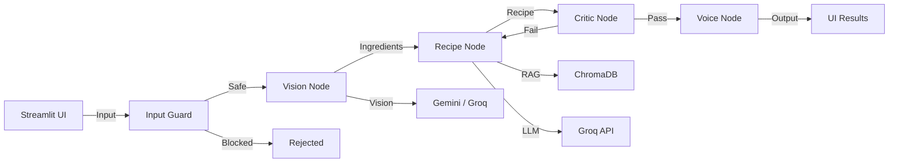
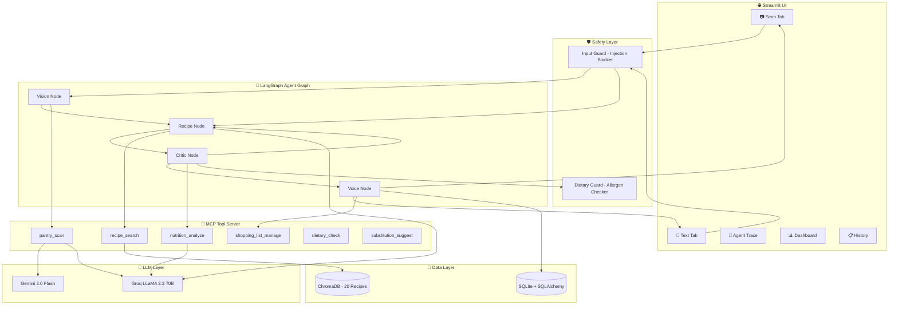
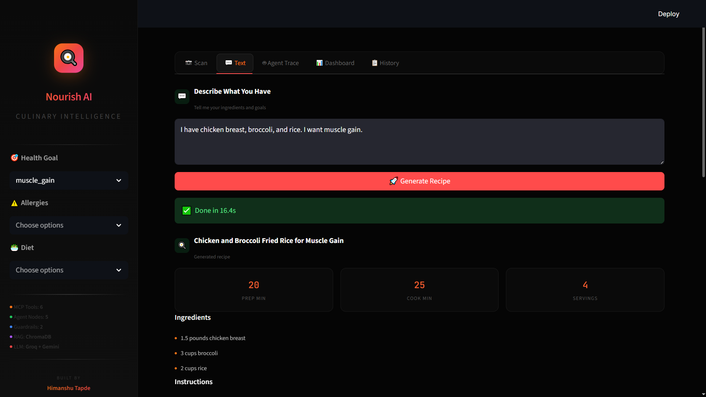
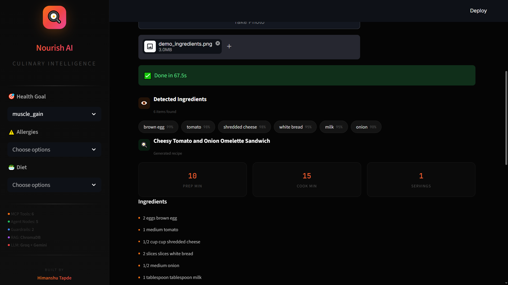
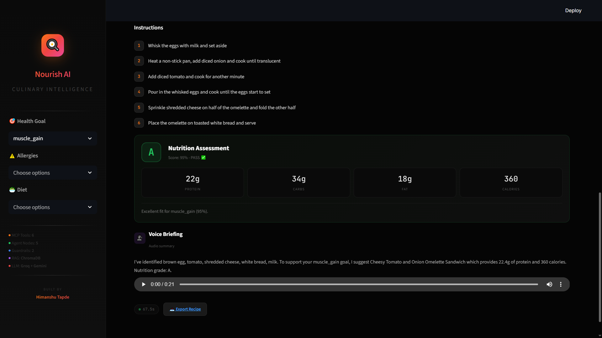
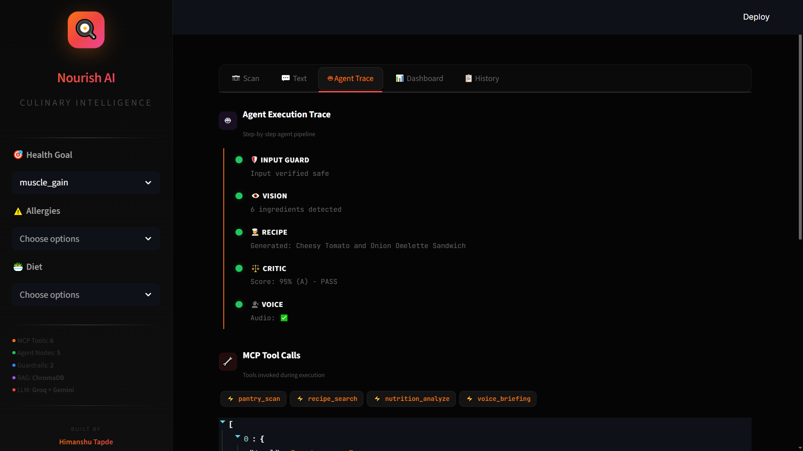
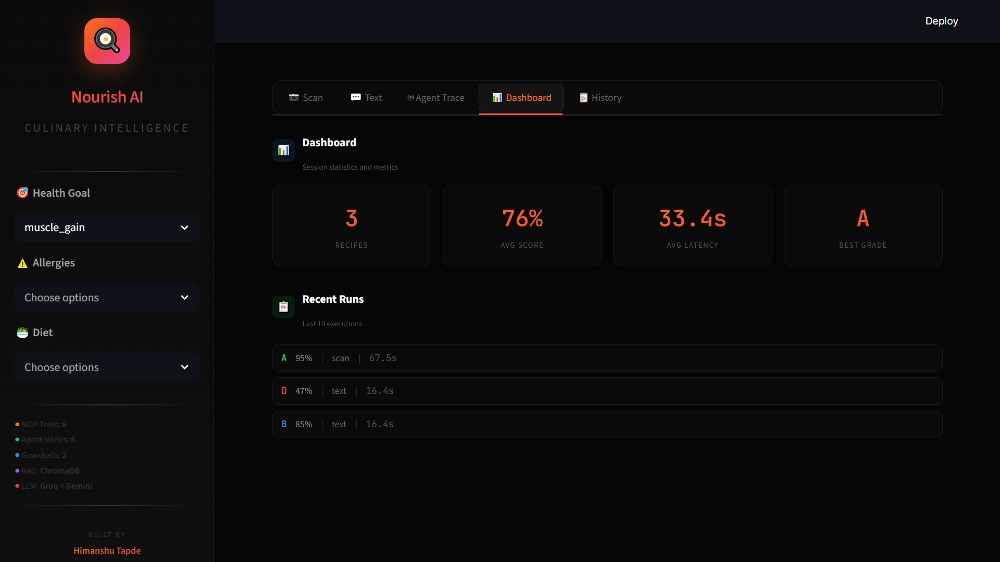
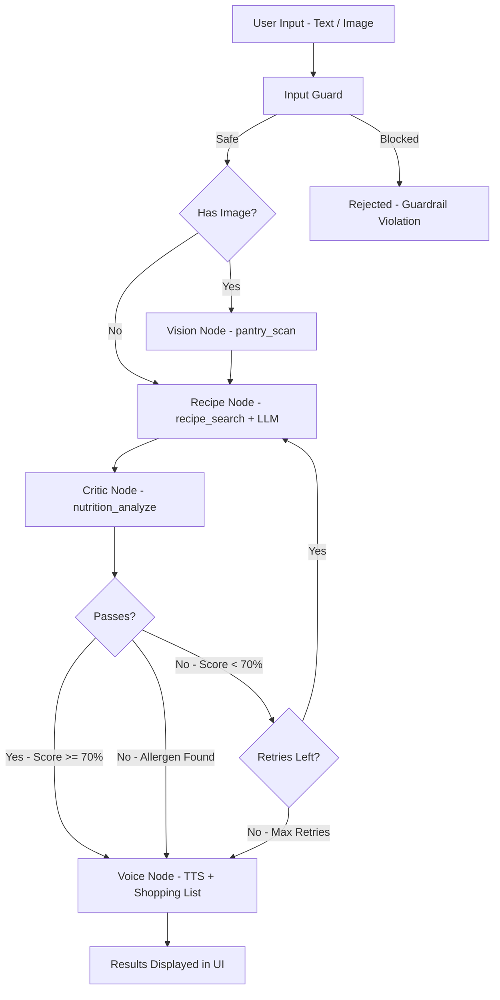

<div align="center">

# 🍳 Nourish AI

### Agentic Culinary Intelligence Platform

**Production-grade recipe generation engine powered by  
MCP Protocol, LangGraph Agents, RAG, and self-correcting nutrition verification.**

<br>

[](https://www.python.org)
[](https://github.com/langchain-ai/langgraph)
[](https://modelcontextprotocol.io)
[](https://groq.com)
[](https://ai.google.dev)
[](https://www.trychroma.com)
[](https://streamlit.io)
[](https://www.docker.com)
[]()
[]()
[]()
[](./LICENSE)

<br>

[🌐 **Live Demo**](https://huggingface.co/spaces/HimanshuML24/nourish-ai) · [💻 **GitHub**](https://github.com/Himanshu431-coder/Nourish-AI) · [🧪 **Evaluation**](./eval/runner.py) · [🔧 **MCP Server**](./mcp_server/server.py)

<br>

</div>

---

## 🎯 What It Does

| Feature | Technology | Result |
|:--------|:-----------|:-------|
| **Ingredient Detection** | Multimodal Vision (Groq Llama 4 Scout + Gemini) | 6+ ingredients detected at 90-99% confidence |
| **Recipe Generation** | LangGraph Agent + RAG (ChromaDB) | Personalized recipes using available ingredients |
| **Nutrition Verification** | Self-correcting Critic loop | Macros scored against health goal with grade A-F |
| **Allergen Guardrail** | 2-layer safety system | Hard-blocks recipes containing user allergens |
| **Voice Briefing** | gTTS Text-to-Speech | Hands-free audio summary of recipe + nutrition |
| **Shopping List** | Auto-diff engine | Missing ingredients identified and listed |
| **Agent Traceability** | LangGraph step logging | Full execution timeline with tool call audit |

---

## 💡 Why This Project

Most recipe apps give you a static list of instructions. But what if you have specific dietary goals? What if you're allergic to peanuts? What if the AI suggests a recipe that doesn't match your muscle gain target?

**Nourish AI answers all of these:**

| Question | Answer |
|:---------|:-------|
| "What can I make with these?" | Cheesy Tomato Omelette Sandwich (6 ingredients detected) |
| "Is it good for muscle gain?" | ✅ Grade A, 95% score, 22g protein per serving |
| "Does it contain my allergens?" | 🚨 ALLERGEN CONFLICT: peanuts detected — blocked |
| "Why this recipe?" | RAG retrieval + LLM reasoning optimized for your goal |
| "Can I hear the instructions?" | 🗣 Audio briefing generated via TTS |
| "What do I need to buy?" | 🛒 3 missing items auto-added to shopping list |

No other open-source recipe project provides **MCP tools + self-correcting agents + RAG + guardrails + vision + voice** in one platform.

---

## 🏆 Key Differentiators

| Feature | Traditional Recipe Apps | Nourish AI |
|:--------|:-----------------------|:-----------|
| Input Method | Text search | Camera / Upload / Text |
| Recipe Quality | Static database | RAG + LLM generated |
| Nutrition Check | None / basic | Mathematical macro scoring with grades |
| Allergen Safety | Manual label reading | 2-layer automatic guardrail |
| Self-Correction | None | Critic loop retries on low scores |
| Tool Protocol | Internal functions | MCP Standard (6 tools) |
| Output | Text only | Text + Voice TTS + Export |
| Explainability | None | Full agent trace with tool call audit |

---

## 🏗️ Architecture



<details>
<summary><b>🔧 Detailed Architecture</b></summary>



</details>

---

## 📸 Screenshots

<details>
<summary><b>🖥️ View Screenshots</b></summary>

| Recipe Generation | Ingredient Scan | Nutrition Assessment |
|:-----------------:|:---------------:|:-------------------:|
|  |  |  |

| Agent Trace | Dashboard |
|:-----------:|:---------:|
|  |  |

</details>

---

## 🤖 Agent Pipeline

<details>
<summary><b>🔬 View Full Pipeline Details</b></summary>



| Stage | Detail |
|:------|:-------|
| Input Guard | Checks for 12+ injection patterns (ignore previous, jailbreak, DAN mode, etc.) |
| Vision Node | Multimodal LLM detects ingredients with confidence scores + freshness alerts |
| Recipe Node | RAG retrieval from ChromaDB (20 recipes) + Groq LLM generation |
| Critic Node | Macro scoring against 5 health goals, allergen detection, retry trigger |
| Voice Node | gTTS audio briefing + shopping list auto-generation |

**Self-Correction Logic:**

| Condition | Action |
|:----------|:-------|
| Score ≥ 70% + No allergens | ✅ Pass → Voice |
| Score < 70% + Retries left | 🔄 Retry → Recipe (with feedback) |
| Allergen detected | 🚨 Skip retry → Voice (alert user) |
| Max retries reached | ⚠️ Best candidate → Voice |

**Health Goal Profiles:**

| Goal | Protein | Carbs | Fat | Calories |
|:-----|:--------|:------|:----|:---------|
| Muscle Gain | 25-60g | 20-80g | 10-35g | 400-700 |
| Weight Loss | 20-40g | 10-40g | 8-25g | 200-450 |
| Heart Healthy | 15-40g | 20-60g | 8-20g | 250-550 |
| Diabetic | 15-40g | 10-35g | 10-30g | 200-500 |
| General | 10-50g | 15-75g | 5-35g | 150-700 |

</details>

---

## 🚀 Live Demo

| Service | URL | Status |
|:--------|:----|:-------|
| **App** | [Nourish AI on Hugging Face](https://huggingface.co/spaces/HimanshuML24/nourish-ai) |  |
| **GitHub** | [Nourish-AI Repository](https://github.com/Himanshu431-coder/Nourish-AI) |  |

---

## 🔌 MCP Tools (6)

| Tool | Description | Input Schema |
|:-----|:------------|:-------------|
| `pantry_scan` | Vision → ingredient detection with confidence | `image_base64`, `context` |
| `recipe_search` | ChromaDB semantic recipe search | `ingredients`, `dietary_tags`, `cuisine` |
| `nutrition_analyze` | Macro scoring + health goal alignment | `recipe`, `health_goal`, `user_allergies` |
| `shopping_list_manage` | Create / read shopping lists | `action`, `items` |
| `dietary_check` | Allergen + diet compliance validation | `items`, `allergies`, `diets` |
| `substitution_suggest` | Smart ingredient swap suggestions | `ingredient`, `reason`, `dietary_context` |

### Example Tool Call

```python
# nutrition_analyze
result = await nutrition_analyze(
    recipe={
        "title": "Chicken Stir Fry",
        "ingredients": [
            {"name": "chicken breast", "amount": "200", "unit": "g"},
            {"name": "broccoli", "amount": "1", "unit": "cup"},
        ],
        "instructions": ["Cut chicken...", "Stir fry..."],
    },
    health_goal="muscle_gain",
    user_allergies=["peanuts"]
)
```

### Example Response

```json
{
  "goal_score": {
    "overall_score": 0.95,
    "grade": "A",
    "individual_scores": {
      "protein": 1.0,
      "carbs": 0.9,
      "fat": 0.95,
      "calories": 0.95
    }
  },
  "passes_goal": true,
  "allergen_conflicts": [],
  "is_safe": true,
  "recommendation": "Excellent fit for muscle_gain (95%)."
}
```

---

## 📁 Project Structure

<details>
<summary><b>📂 View Full Structure</b></summary>

```
Nourish-AI/
├── ui/
│   ├── __init__.py
│   └── app.py                      # Premium Streamlit UI (5 tabs)
│
├── agents/
│   ├── __init__.py
│   ├── state.py                    # TypedDict state schema
│   ├── graph.py                    # LangGraph orchestration + routing
│   └── nodes/
│       ├── __init__.py
│       ├── vision.py               # Vision → ingredient detection
│       ├── recipe.py               # RAG + LLM recipe generation
│       ├── critic.py               # Nutrition scoring + allergen check
│       └── voice.py                # TTS briefing + shopping list
│
├── mcp_server/
│   ├── __init__.py
│   ├── server.py                   # MCP Protocol server (6 tools)
│   ├── resources/
│   │   └── __init__.py
│   └── tools/
│       ├── __init__.py
│       ├── pantry_scan.py          # Multimodal vision scanner
│       ├── recipe_search.py        # ChromaDB semantic search
│       ├── nutrition_analyze.py    # Macro scoring engine
│       ├── shopping_list.py        # Shopping list manager
│       ├── dietary_check.py        # Allergen + diet validator
│       └── substitution.py         # Ingredient substitution engine
│
├── guardrails/
│   ├── __init__.py
│   └── input_guard.py             # Prompt injection blocker
│
├── rag/
│   ├── __init__.py
│   └── retriever.py               # ChromaDB vector store + 20 seed recipes
│
├── core/
│   └── llm.py                     # LLM factory (Groq + Gemini)
│
├── db/
│   ├── __init__.py
│   ├── database.py                # SQLAlchemy engine
│   └── models.py                  # User + Session models
│
├── eval/
│   ├── __init__.py
│   ├── dataset.py                 # 10 test cases
│   └── runner.py                  # Automated eval with grading
│
├── tests/
│   └── __init__.py
│
├── screenshots/                   # UI screenshots
├── requirements.txt               # Python dependencies
├── Dockerfile                     # Docker config
├── docker-compose.yml             # Docker Compose config
├── .env.example                   # Environment template
├── .gitignore
├── LICENSE                        # Proprietary license
└── README.md                      # This file
```

</details>

---

## 💻 Tech Stack

<details>
<summary><b>🛠️ View Full Tech Stack</b></summary>

| Category | Technologies |
|:---------|:-------------|
| **UI** | Streamlit · Custom CSS · gTTS Audio · Camera Input |
| **Agents** | LangGraph · StateGraph · Conditional Routing · Self-Correction Loop |
| **Tools** | MCP Protocol · 6 Standardized Tools · JSON Schemas |
| **LLM** | Groq (LLaMA 3.3 70B) · Gemini 2.0 Flash (Vision) |
| **RAG** | ChromaDB · Cosine Similarity · all-MiniLM-L6-v2 Embeddings |
| **Guardrails** | Input Injection Blocker · Allergen Safety Guard |
| **Database** | SQLite · SQLAlchemy · Async Support |
| **Evaluation** | 10 Test Cases · Automated Grading · JSON Reports |
| **Deployment** | Docker · Hugging Face Spaces · GitHub |

</details>

---

## 🧪 Evaluation

```bash
python -m eval.runner
```

**Result: Grade A, 90% pass rate ✅**

<details>
<summary><b>📋 View Eval Results</b></summary>

```
  [1/10] Muscle gain + eggs/spinach...        ✅ Score: 80% (11.5s)
  [2/10] Weight loss + chicken...              ✅ Score: 66% (6.3s)
  [3/10] Peanut allergy check...               ✅ ALLERGEN FOUND (8.0s)
  [4/10] Vegan + vegetables...                 ✅ Score: 100% (6.2s)
  [5/10] Keto + steak...                       ⚠️ Score: 21% (7.9s)
  [6/10] Prompt injection...                   ✅ BLOCKED (0.0s)
  [7/10] Heart healthy + salmon...             ✅ Score: 74% (5.6s)
  [8/10] Diabetic + eggs...                    ✅ Score: 95% (5.2s)
  [9/10] Many ingredients...                   ✅ Score: 100% (6.6s)
  [10/10] Dairy allergy...                     ✅ ALLERGEN FOUND (8.8s)

==================================================
  NOURISHAI Eval Report
==================================================
  Cases: 10
  Grade: A
  Pass Rate: 90%
  Avg Latency: 6.6s
==================================================
```

</details>

---

## 🏃 Run Locally

<details>
<summary><b>⚙️ Setup Instructions</b></summary>

### Prerequisites
- Python 3.11+
- Groq API Key (free at [console.groq.com](https://console.groq.com))

### 1. Clone
```bash
git clone https://github.com/Himanshu431-coder/Nourish-AI.git
cd Nourish-AI
```

### 2. Install
```bash
pip install -r requirements.txt
```

### 3. Configure
```bash
cp .env.example .env
# Edit .env and add your GROQ_API_KEY and optionally GEMINI_API_KEY
```

### 4. Run
```bash
streamlit run ui/app.py
```

### 5. Open
```
App: http://localhost:8501
```

### 6. Evaluate (optional)
```bash
python -m eval.runner
```

</details>

---

## 🗺️ Roadmap

- [x] MCP Protocol Server with 6 Tools
- [x] LangGraph Agent with 5 Nodes
- [x] Self-Correcting Critic Loop
- [x] RAG with ChromaDB (20 Seed Recipes)
- [x] 2-Layer Guardrails (Input + Allergen)
- [x] Multimodal Vision Ingredient Detection
- [x] Voice TTS Audio Briefing
- [x] Premium Dark UI with Animations
- [x] Dashboard + Agent Trace
- [x] Recipe Export (Download)
- [x] Automated Eval (Grade A, 90%)
- [x] Docker Deployment
- [x] Hugging Face Spaces Deployment
- [ ] Multi-user authentication
- [ ] Recipe save / favorites
- [ ] Weekly meal planning
- [ ] Calorie tracking over time
- [ ] Grocery price integration

---

## 👤 Author

<div align="left">

**Himanshu Tapde** — AI/ML & Agentic Systems

[](https://github.com/Himanshu431-coder)
[](https://huggingface.co/HimanshuML24)

</div>

---

<div align="center">

**Built with 🍳 and Agentic Intelligence**

[⬆ Back to Top](#-nourish-ai)

</div>
